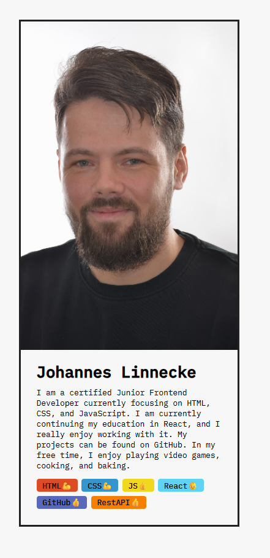

## Improvements compared to Challenge 1

- Automated rendering of skills using the `map()` method
- Dynamic data flow using props
- Refactored skill data structure with level and color properties
- Dynamic emoji rendering based on skill level using the ternary operator
- Added new skills and improved component structure

Different approaches were tested and documented in comments inside the codebase, including:

- full object props
- destructured props
- ternary operators
- short-circuit rendering
